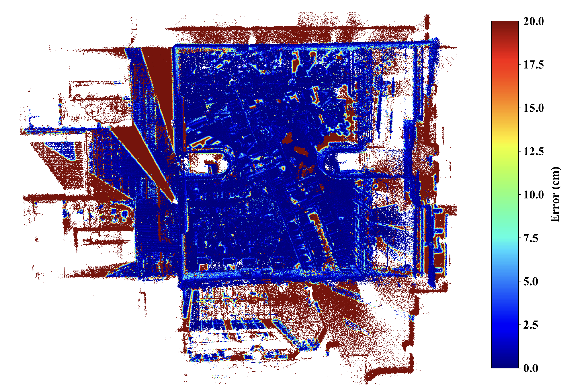
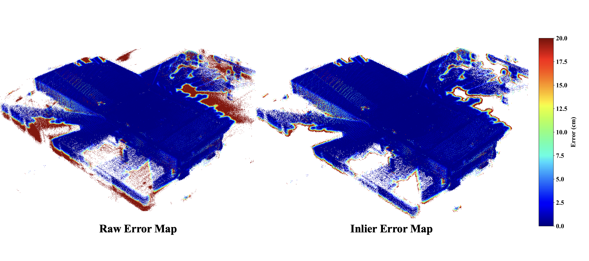

# Cloud Map Evaluation

Point cloud map evaluation library  for the [FusionPortable](https://ram-lab.com/file/site/fusionportable/dataset/fusionportable/) dataset.  The Metrics include RMSE, Accuracy(mean error), Precision(standard deviation), Completeness(overlap ratio), Chamfer distance(CD) and F1-score at all levels of `1/2/5/10/20`cm.  For those do not have ground truth maps, we use Mean Map Entropy (MME).

**Author**: Xiangcheng HU, [Jiaojian Hao](https://github.com/gogojjh).

## Dependencies

- *[Open3d ( >= 0.11)](https://github.com/isl-org/Open3D)* 

- Eigen3

## Test Data(password: 1)

| sequence                                                     | Test PCD                                                     | GT PCD                                                       |
| ------------------------------------------------------------ | ------------------------------------------------------------ | ------------------------------------------------------------ |
| MCR_slow                                                     | [map.pcd](https://hkustconnect-my.sharepoint.com/:u:/g/personal/xhubd_connect_ust_hk/ES9eSANEr-9NvkFqMzMFsecBo5r3hBpBnj0c6BMPgsfXnQ?e=aijdPf) | [map_gt.pcd](https://hkustconnect-my.sharepoint.com/:u:/g/personal/xhubd_connect_ust_hk/ESfn5EEsiPlCiJcydVc_HqgBDGqy65MHoyu63XE-iKbFBQ?e=dTDon4) |
| [FusionPortable Dataset](https://ram-lab.com/file/site/fusionportable/dataset/fusionportable/#download) |                                                              |                                                              |

## Usage

1. install open3d. (maybe a higer version of CMake is needed)

```bash
git clone https://github.com/isl-org/Open3D.git
cd Open3D && mkdir build && cd build   
cmake ..
make install
```

2. install cloud_map_eval

```bash
git clone https://github.com/JokerJohn/Cloud_Map_Evaluation.git
cd Cloud_Map_Evaluation/cloud_map_eval && mkdir build
cmake ..
./cloud_map_eval
```

3. set some params

```c++
double icp_max_distance = 0.5;             // max correspondence pairs distance for  knn search in icp
int method = 2;                            // 0:point-to-point icp 1:point-to-plane icp 
Vector5d accuacy_level = Vector5d::Zero();   // set evaluatation accucay level, eg. 20cm/10cm/5cm/2cm/1cm
accuacy_level << 0.2, 0.1, 0.05, 0.02, 0.01;  //  do not recommand to change this

Eigen::Matrix4d initial_matrix = Eigen::Matrix4d::Identity();   // initial pose for your map

// the path dir must end with '/'
std::string est_path, gt_path, results_path, sequence_name;
std::string est_folder = "/home/xchu/my_git/Cloud_Map_Evaluation/cloud_map_evaluation/dataset/";
sequence_name = "MCR_slow";
est_path = est_folder + sequence_name + "/";
gt_path = est_folder + sequence_name + "/" + sequence_name + "_gt.pcd";
results_path = est_folder + sequence_name + "/";

// in  you want to evaluate mme
bool evaluate_mme = true;
bool evaluate_gt_mme = true;  // for gt map, we do not use it
```

4. get the final results

we have a point cloud map generated by a pose-slam system, and we have a ground truth point cloud map. Then we caculate related metrics.


We can also get a rendered raw distance-error map(10cm) and inlier distance-error map(2cm) in this process, the color R->G->B represent for the distance error at a level of 0-10cm.



if we do not have gt map, we can evaluate the **Mean Map Entropy (MME)**, smaller means better consistency.


we can also get a simpe mesh reconstructed from point cloud map.


5. we got the result flies.


## Important Parameters

```c++
bool eva_mesh = false;  // if we construct a simple meth.
bool eva_mme = true; // if we evaluate mme without gt map.

// Downsampling for efficiency
map_3d_ = map_3d_->VoxelDownSample(0.03);
gt_3d_ = gt_3d_->VoxelDownSample(0.03);

double radius = 0.5;  // we choose a nearest distance of 0.5m to caculate the point cov for mme caculation.
mme_est = ComputeMeanMapEntropy(map_3d_, est_entropies, radius);
mme_gt = ComputeMeanMapEntropy(gt_3d_, gt_entropies, radius);


// rendering distance map
// when render the inlier distance map and raw distance map, we choose a thresohold of trunc_dist_[0] (20cm).
map_3d_render_inlier = renderDistanceOnPointCloud(corresponding_cloud_gt, corresponding_cloud_est, param_.trunc_dist_[0]);
map_3d_render_raw = enderDistanceOnPointCloud(gt_3d_, map_3d_, param_.trunc_dist_[0]);
```


## Issues

### How do you get your initial pose?

we can use [CloudCompare](https://github.com/CloudCompare/CloudCompare) to align LIO map to Gt map .

- Roughly  translate and rotate the LIO point cloud map to the GT map。

- Manually register the moved LIO map (aligned) to the GT map (reference), and get the output of the terminal transfrom `T2`, then the initial pose matrix is the terminal output transform `T`.


### What's the difference between raw rendered map and inlier rendered map?

The primary function of the r**aw rendered map** (left) is to color-code the error of all points in the map estimated by the algorithm. For each point in the estimated map that does not find a corresponding point in the **ground truth (gt) map**, it is defaulted to the maximum error (**20cm**), represented as red. On the other hand, the i**nlier rendered map** (right) excludes the non-overlapping regions of the point cloud and colors only the error of the inlier points after point cloud matching. This map therefore contains only a portion of the points from the original estimated map.



## Publications

We kindly recommend to cite [our paper](https://arxiv.org/abs/2208.11865) if you find this library useful:

```latex
@inproceedings{jiao2022fusionportable,
  title        = {Fusionportable: A multi-sensor campus-scene dataset for evaluation of localization and mapping accuracy on diverse platforms},
  author       = {Jiao, Jianhao and Wei, Hexiang and Hu, Tianshuai and Hu, Xiangcheng and Zhu, Yilong and He, Zhijian and Wu, Jin and Yu, Jingwen and Xie, Xupeng and Huang, Huaiyang and others},
  booktitle    = {2022 IEEE/RSJ International Conference on Intelligent Robots and Systems (IROS)},
  pages        = {3851--3856},
  year         = {2022},
  organization = {IEEE}
}

@ARTICLE{hu2024paloc,
  author={Hu, Xiangcheng and Zheng, Linwei and Wu, Jin and Geng, Ruoyu and Yu, Yang and Wei, Hexiang and Tang, Xiaoyu and Wang, Lujia and Jiao, Jianhao and Liu, Ming},
  journal={IEEE/ASME Transactions on Mechatronics}, 
  title={PALoc: Advancing SLAM Benchmarking With Prior-Assisted 6-DoF Trajectory Generation and Uncertainty Estimation}, 
  year={2024},
  volume={},
  number={},
  pages={1-12},
  doi={10.1109/TMECH.2024.3362902}
  }

```